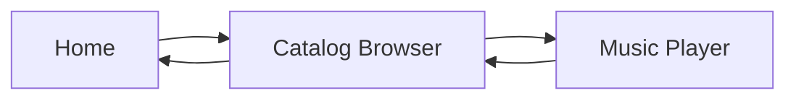

The catalog browsing system allows users to explore the complete collection of huayno songs, filtered by category and organized by musical tonality.

## Overview

The catalog browser (`lista-temas.html`) provides:

- Real-time search across titles and artists
- Automatic tonality-based sorting
- Color-coded cards by musical key
- Visual distinction between major and minor keys
- Category filtering via URL parameters

## Data Loading

Songs are fetched from Firestore on page load (`lista-temas.html:379-389`):

```javascript
async function cargarTemas() {
    listaDiv.innerHTML = `<p class="state-msg">Cargando...</p>`;
    try {
        const snap = await getDocs(query(collection(db, "temas"), where("categoria","==",catActual)));
        temasCache = snap.docs.map(d => ({ id: d.id, ...d.data() }));
        renderFiltrado();
    } catch(e) {
        console.error(e);
        listaDiv.innerHTML = `<p class="state-msg error">Error de conexión.</p>`;
    }
}
```

<Note>
  The catalog uses Firestore's local persistence cache (enabled in `firebase.js:25`) to provide instant loading on subsequent visits.
</Note>

## Search Functionality

Real-time search filters by title or artist using normalized text comparison:

### Text Normalization

From `lista-temas.html:374`:

```javascript
const normalizar = t => t ? t.normalize("NFD").replace(/[\u0300-\u036f]/g,"").toLowerCase() : "";
```

This removes accents and converts to lowercase, allowing users to search "Peru" and match "Perú".

### Search Implementation

From `lista-temas.html:391-404`:

```javascript
function renderFiltrado(filtro = "") {
    const txt = normalizar(filtro);
    const lista = temasCache
        .filter(t => normalizar(t.titulo).includes(txt) || normalizar(t.artista).includes(txt))
        .sort((a, b) => {
            const nA = (a.tonalidad||"").toLowerCase().split(" ")[0];
            const nB = (b.tonalidad||"").toLowerCase().split(" ")[0];
            const mA = (a.tonalidad||"").toLowerCase().includes("menor") ? 1 : 0;
            const mB = (b.tonalidad||"").toLowerCase().includes("menor") ? 1 : 0;
            const d  = (ORDEN_NOTAS[nA]||99) - (ORDEN_NOTAS[nB]||99);
            if (d !== 0) return d;
            if (mA !== mB) return mA - mB;
            return (a.titulo||"").localeCompare(b.titulo||"");
        });
    // ...
}
```

Search input listener from `lista-temas.html:429`:

```javascript
buscador.addEventListener("input", e => renderFiltrado(e.target.value));
```

## Tonality Sorting

Songs are automatically sorted by musical key to help users find practice material in their preferred tonality.

### Note Order

Defined in `lista-temas.html:375`:

```javascript
const ORDEN_NOTAS = { do:1, re:2, mi:3, fa:4, sol:5, la:6, si:7 };
```

### Multi-Level Sort

The sorting algorithm applies three levels:

1. **Primary**: Musical note (do, re, mi, etc.)
2. **Secondary**: Mode (major before minor)
3. **Tertiary**: Alphabetical by title

This ensures that "Do Mayor" songs appear before "Do Menor", which appear before "Re Mayor".

## Color-Coded Cards

Each musical key is assigned a unique color to provide instant visual recognition.

### Color Mapping

Cards use CSS custom properties to apply tonality colors (`lista-temas.html:272-278`):

```css
.card.tema-card.tone-do{--tone:229,9,20}
.card.tema-card.tone-re{--tone:255,123,0}
.card.tema-card.tone-mi{--tone:255,196,0}
.card.tema-card.tone-fa{--tone:33,198,131}
.card.tema-card.tone-sol{--tone:22,163,255}
.card.tema-card.tone-la{--tone:112,86,255}
.card.tema-card.tone-si{--tone:228,79,227}
```

### Dynamic Class Application

From `lista-temas.html:414-418`:

```javascript
const tonalidadRaw = normalizar(t.tonalidad || "");
const notaBase = tonalidadRaw.split(" ")[0] || "";
const claseNota = ["do", "re", "mi", "fa", "sol", "la", "si"].includes(notaBase) ? `tone-${notaBase}` : "";
const claseModo = tonalidadRaw.includes("menor") ? "modo-menor" : tonalidadRaw.includes("mayor") ? "modo-mayor" : "";
a.className = `card tema-card ${claseNota} ${claseModo}`.trim();
```

<CardGroup cols={3}>
  <Card title="Do (C)" icon="circle" color="#e50914">
    Red accent - Root tonality
  </Card>
  <Card title="Re (D)" icon="circle" color="#ff7b00">
    Orange - Warm tone
  </Card>
  <Card title="Mi (E)" icon="circle" color="#ffc400">
    Yellow - Bright tone
  </Card>
  <Card title="Fa (F)" icon="circle" color="#21c683">
    Green - Natural tone
  </Card>
  <Card title="Sol (G)" icon="circle" color="#16a3ff">
    Blue - Cool tone
  </Card>
  <Card title="La (A)" icon="circle" color="#7056ff">
    Purple - Deep tone
  </Card>
  <Card title="Si (B)" icon="circle" color="#e44fe3">
    Magenta - High tone
  </Card>
</CardGroup>

## Card Design

### Card Structure

From `lista-temas.html:419-424`:

```javascript
a.innerHTML = `
    <div>
        <span class="titulo">${t.titulo||"Sin título"}</span>
        <div class="artista-sub">${t.artista||"Artista"}</div>
    </div>
    <span class="tono-tag">${t.tonalidad||"--"}</span>`;
```

Each card displays:
- **Title** - Song name in bold
- **Artist** - Band or performer name
- **Tonality badge** - Musical key with color coding

### Visual Indicators

Cards have multiple visual layers (`lista-temas.html:194-236`):

```css
.card.tema-card::before{
    content:"";
    position:absolute;
    inset:0;
    background:linear-gradient(140deg, rgba(var(--tone), .2), transparent 45%, rgba(255,255,255,.04));
    opacity:.55;
    pointer-events:none;
}

.card.tema-card::after{
    content:"";
    position:absolute;
    left:0;
    top:0;
    bottom:0;
    width:4px;
    background:rgba(var(--tone), .95);
    box-shadow:0 0 16px rgba(var(--tone), .55);
    pointer-events:none;
}
```

**Visual Features:**
- Colored left border (4px accent stripe)
- Gradient overlay using tonality color
- Hover lift animation
- Glow effect on hover

### Minor Key Styling

Minor keys use dashed borders to distinguish them from major keys (`lista-temas.html:266-270`):

```css
.card.tema-card.modo-menor .tono-tag{
    border-style:dashed;
    color:#f0f0f0;
    background:linear-gradient(180deg, rgba(var(--tone), .18), rgba(0,0,0,.28));
}
```

<Warning>
  The dashed border style for minor keys is a critical visual cue. Users rely on this to quickly identify harmonic mode.
</Warning>

## Grid Layout

Responsive grid from `lista-temas.html:188-192`:

```css
.grid-huaynos{
    display:grid;
    grid-template-columns:repeat(auto-fill, minmax(220px, 1fr));
    gap:14px;
}
```

This creates a flexible grid that:
- Fills available width
- Maintains minimum card width of 220px
- Adjusts column count based on viewport
- Maintains consistent 14px gaps

## Search Bar

Sticky search bar that remains visible while scrolling (`lista-temas.html:157-184`):

```css
.buscador-wrap{
    position:sticky;
    top:84px;
    z-index:18;
    margin-bottom:12px;
}

.buscador{
    width:100%;
    height:50px;
    border-radius:12px;
    border:1px solid var(--line);
    background:rgba(10,10,10,.82);
    backdrop-filter:blur(10px);
    color:#fff;
    font-size:.97rem;
    padding:0 14px;
    outline:none;
    transition:border-color .2s, box-shadow .2s;
    box-shadow:0 12px 26px rgba(0,0,0,.38);
}
```

The search bar:
- Sticks to top when scrolling
- Has blur backdrop effect
- Shows red accent on focus
- Includes search icon emoji in placeholder

## Category Filtering

Categories are selected via URL parameter (`lista-temas.html:369-370`):

```javascript
const params    = new URLSearchParams(window.location.search);
const catActual = params.get('cat') || 'huayno';
```

Supported categories:
- `huayno` - Traditional Peruvian huayno
- `salay` - Salay dance music
- `cumbia` - Cumbia style

## Empty States

From `lista-temas.html:406-409`:

```javascript
if (!lista.length) {
    listaDiv.innerHTML = `<p class="state-msg">Sin resultados.</p>`;
    return;
}
```

The system displays appropriate messages for:
- **Loading** - "Cargando..."
- **No results** - "Sin resultados."
- **Error** - "Error de conexión." (with error styling)

## Hero Section

The page includes an informational hero banner (`lista-temas.html:339-349`):

```html
<section class="hero-mini">
    <div class="hero-mini-content">
        <h1>Explora tus temas</h1>
        <p>Filtra por nombre o artista y abre cada tema en el reproductor con una experiencia visual consistente y elegante.</p>
        <div class="chips">
            <span class="chip">Catálogo premium</span>
            <span class="chip">Orden tonal</span>
            <span class="chip">Acceso rápido</span>
        </div>
    </div>
</section>
```

Features decorative chips highlighting key benefits:
- **Catálogo premium** - High-quality curated content
- **Orden tonal** - Tonality-based organization
- **Acceso rápido** - Fast navigation and loading

## Performance Optimization

### Local Caching

Firestore persistence is enabled in `firebase.js:25-33`:

```javascript
enableIndexedDbPersistence(db).catch((err) => {
    if (err.code == 'failed-precondition') {
        console.warn("La persistencia falló: Múltiples pestañas abiertas.");
    } else if (err.code == 'unimplemented') {
        console.warn("El navegador no soporta persistencia de datos.");
    }
});
```

### In-Memory Cache

All songs are cached in memory after first load (`lista-temas.html:377`):

```javascript
let temasCache = [];
```

This allows instant filtering without additional database queries.

## Navigation Flow



From `lista-temas.html:316-321`:

```html
<a href="home.html" class="btn-nav">
    <svg viewBox="0 0 24 24" fill="none" stroke="currentColor" stroke-width="2.5" width="12" height="12">
        <path d="M19 12H5M12 19l-7-7 7-7"/>
    </svg>
    <span>Volver</span>
</a>
```

Each song card links to the player with category context (`lista-temas.html:413`):

```javascript
a.href = `reproductor.html?id=${t.id}&cat=${catActual}`;
```

<Tip>
  The category parameter is preserved throughout navigation, ensuring the "Back" button returns users to the correct filtered view.
</Tip>

## Related

<CardGroup cols={2}>
  <Card title="Music Player" icon="play" href="/features/music-player">
    Play selected songs with custom controls
  </Card>
  <Card title="Admin Panel" icon="database" href="/features/admin-panel">
    Manage catalog content and metadata
  </Card>
</CardGroup>