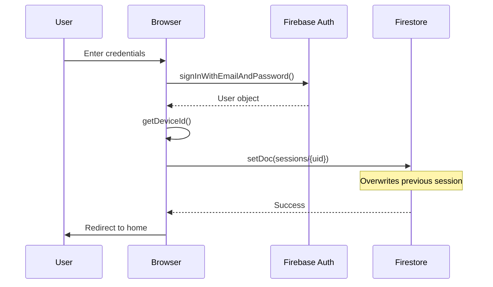
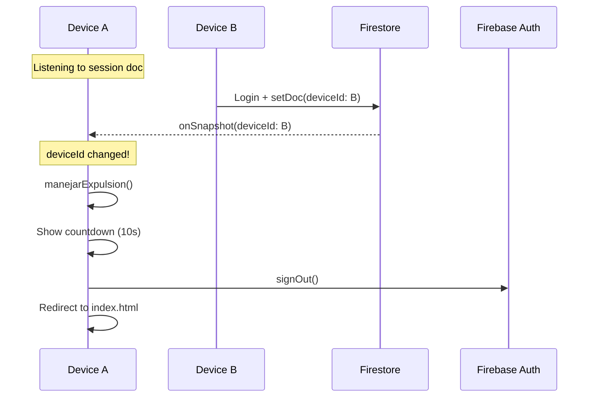

Ripper implements a single-device session management system that ensures only one active session per user account across all devices and browsers.

## Architecture Overview

The session system has two core functions with distinct responsibilities:

### `reclamarSesion()` - Claim Session

**Called once** during login to establish device ownership.

From `js/seguridad.js:32-38`:

```javascript
export async function reclamarSesion(db, userId) {
    const deviceId = getDeviceId();
    await setDoc(doc(db, "sessions", userId), {
        deviceId,
        claimedAt: Date.now()
    }); // sin merge → sobreescritura total → expulsa al dispositivo anterior
}
```

<Note>
  The `setDoc` call **without merge** completely overwrites the previous session document, effectively expelling any other device.
</Note>

### `vigilarSesion()` - Monitor Session

**Called on every protected page** to watch for displacement.

From `js/seguridad.js:74-109`:

```javascript
export function vigilarSesion(auth, db, contenedorId) {
    const deviceId = getDeviceId();
    let unsub = null;
    let expulsado = false;

    auth.onAuthStateChanged((user) => {
        if (!user) {
            if (!window.location.pathname.includes("index.html"))
                window.location.href = "index.html";
            return;
        }

        const sessionRef = doc(db, "sessions", user.uid);

        // Limpiar listener anterior si existe
        if (unsub) { unsub(); unsub = null; }

        // SOLO ESCUCHAR — nunca escribir aquí
        unsub = onSnapshot(sessionRef, (snap) => {
            if (expulsado) return;
            if (!snap.exists()) return; // Sin documento aún, esperar

            const data = snap.data();

            // Si el deviceId guardado ya no es el nuestro → alguien más hizo login → expulsión
            if (data.deviceId && data.deviceId !== deviceId) {
                expulsado = true;
                if (unsub) { unsub(); unsub = null; }
                const wrapper = document.getElementById(contenedorId);
                manejarExpulsion(wrapper, auth);
            }
        }, (err) => {
            console.warn("Error listener sesión:", err);
        });
    });
}
```

<Warning>
  `vigilarSesion()` **only listens** - it never writes to Firestore. Writing would cause devices to overwrite each other without triggering expulsion.
</Warning>

## Device Identification

Each browser receives a unique, persistent device ID stored in localStorage.

From `js/seguridad.js:21-29`:

```javascript
export const getDeviceId = () => {
    let id = localStorage.getItem("rip_deviceId");
    if (!id) {
        // Usamos una combinación de tiempo y random por si crypto no está disponible
        id = 'dev_' + Math.random().toString(36).substr(2, 9) + Date.now();
        localStorage.setItem("rip_deviceId", id);
    }
    return id;
};
```

**Device ID format:** `dev_[random]_[timestamp]`

Example: `dev_k3x7m2p9_1678901234567`

### Persistence Strategy

- **Stored in:** `localStorage`
- **Key:** `rip_deviceId`
- **Lifetime:** Permanent (until browser cache cleared)
- **Scope:** Per browser profile (not per tab)

<Tip>
  Using localStorage (not sessionStorage) ensures the device ID persists across tabs and browser restarts, providing true device-level identification.
</Tip>

## Session Flow

### Login Sequence



### Displacement Detection



## Expulsion Screen

When a user is displaced, they see a countdown screen before automatic logout.

From `js/seguridad.js:41-71`:

```javascript
export function manejarExpulsion(contenedor, auth) {
    if (!contenedor) return;

    // Reemplaza todo el contenido de la página con la pantalla de expulsión
    contenedor.innerHTML = `
        <div style="min-height:80vh; display:flex; align-items:center; justify-content:center; padding:20px;">
            <div class="expulsion-card">
                <div style="font-size:3rem; margin-bottom:12px;">🚫</div>
                <h3 style="color:#e50914; font-size:1.4rem; margin-bottom:10px;">Sesión desplazada</h3>
                <p style="color:#ccc; margin-bottom:16px;">Tu cuenta fue abierta en otro dispositivo o navegador.</p>
                <div class="aviso-importante">
                    ⚠️ <strong>Recuerda:</strong> Solo se permite <b>un dispositivo activo</b> por cuenta a la vez.
                </div>
                <p style="color:#fff; margin-top:20px; font-size:0.95rem;">
                    Cerrando sesión en <span id="seg-cuenta" style="color:#e50914; font-weight:700; font-size:1.2rem;">10</span>s...
                </p>
            </div>
        </div>`;

    let seg = 10;
    const t = setInterval(async () => {
        seg--;
        const el = document.getElementById("seg-cuenta");
        if (el) el.textContent = seg;
        if (seg <= 0) {
            clearInterval(t);
            await signOut(auth);
            window.location.href = "index.html";
        }
    }, 1000);
}
```

**Expulsion features:**
- Replaces entire page content
- Shows 10-second countdown
- Explains reason for displacement
- Auto-logout and redirect

<Warning>
  The expulsion screen completely replaces page content to prevent user interaction during the countdown.
</Warning>

## Integration Points

### Login Page

After successful authentication, claim the session:

```javascript
import { reclamarSesion } from "./js/seguridad.js";

// After successful signIn
const userCredential = await signInWithEmailAndPassword(auth, email, password);
await reclamarSesion(db, userCredential.user.uid);
window.location.href = "home.html";
```

### Protected Pages

Every protected page must call `vigilarSesion()` to monitor for displacement.

**Example from** `reproductor.html:599`:

```javascript
import { vigilarSesion, globalLogout } from "./js/seguridad.js";

vigilarSesion(auth, db, "page-body");
document.getElementById("btnLogOut").onclick = () => globalLogout(auth);
```

**Example from** `lista-temas.html:366`:

```javascript
vigilarSesion(auth, db, "lista-wrapper");
document.getElementById("btnLogOut").onclick = () => globalLogout(auth);
```

### Container ID Parameter

The `contenedorId` parameter specifies which DOM element to replace with the expulsion screen:

```javascript
vigilarSesion(auth, db, "page-body");
//                      ^^^^^^^^^^^^
//                      Element to replace on expulsion
```

<Tip>
  Use the main content container ID - typically the top-level div that wraps all page content except global styles.
</Tip>

## Global Logout

From `js/seguridad.js:112-115`:

```javascript
export async function globalLogout(auth) {
    await signOut(auth);
    window.location.href = "index.html";
}
```

Used by logout buttons throughout the application:

```javascript
document.getElementById("btnLogOut").onclick = () => globalLogout(auth);
```

## Firestore Data Model

### Collection: `sessions`

**Document ID:** User UID

**Fields:**

| Field | Type | Description |
|-------|------|-------------|
| `deviceId` | string | Current active device identifier |
| `claimedAt` | number | Timestamp when session was claimed |

**Example document:**

```json
{
  "deviceId": "dev_k3x7m2p9_1678901234567",
  "claimedAt": 1678901234567
}
```

### Security Rules

Recommended Firestore security rules:

```javascript
match /sessions/{userId} {
  // Users can only read/write their own session
  allow read, write: if request.auth != null && request.auth.uid == userId;
}
```

## Edge Cases

### Multiple Tabs on Same Device

Since `deviceId` is stored in localStorage (not sessionStorage), multiple tabs on the same device share the same ID and do **not** displace each other.

### Cleared Browser Cache

If a user clears localStorage:
1. New `deviceId` is generated on next visit
2. User logs in with new ID
3. Previous device (if still active) gets displaced

### Offline Behavior

Firestore persistence (enabled in `firebase.js:25`) allows:
- Offline login if credentials cached
- Pending session claims when back online
- Displacement detection resumes on reconnection

### Rapid Device Switching

If users rapidly switch between devices:
1. Each login overwrites the session
2. Previous device detects change via `onSnapshot`
3. Countdown begins immediately
4. Device has 10 seconds before forced logout

<Note>
  The 10-second countdown gives users time to see the displacement message before being logged out.
</Note>

## Common Issues

### Issue: Users Not Being Displaced

**Cause:** `vigilarSesion()` is writing to Firestore instead of only listening.

**Solution:** Ensure `vigilarSesion()` contains **no** `setDoc()` or `updateDoc()` calls.

### Issue: Displacement Loop

If two devices keep displacing each other:

**Cause:** Both devices are writing on every page load.

**Solution:** Only write session in `reclamarSesion()` during login, never in `vigilarSesion()`.

### Issue: Session Document Not Created

**Cause:** `reclamarSesion()` not called after login.

**Solution:** Add `await reclamarSesion(db, user.uid)` immediately after successful `signInWithEmailAndPassword()`.

## Best Practices

<CardGroup cols={2}>
  <Card title="Write Once" icon="pen">
    Only write session data during login via `reclamarSesion()`
  </Card>
  <Card title="Listen Everywhere" icon="ear-listen">
    Call `vigilarSesion()` on every protected page
  </Card>
  <Card title="Container Strategy" icon="box">
    Use main content container for expulsion replacement
  </Card>
  <Card title="User Communication" icon="message">
    Show clear displacement message explaining the policy
  </Card>
</CardGroup>

## Related

<CardGroup cols={2}>
  <Card title="Admin Panel" icon="shield" href="/features/admin-panel">
    See admin-specific authentication
  </Card>
  <Card title="Firebase Setup" icon="database" href="/technical/firebase-setup">
    Configure Firestore security rules
  </Card>
</CardGroup>